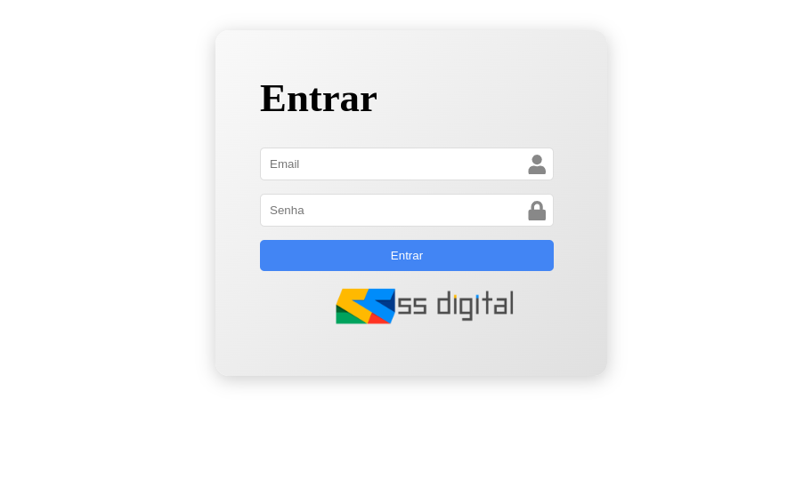

# Modelo I

Modelo I do desafio. Feito em React+Vite.

## Estrutua

...

## Requisitos

Node 18 ou superior

## Instalação

1. Clone o repositório e entre no diretório:

   ```bash
   git clone [clone the project]
   cd react

   ```

2. Instale dependências:

   ```bash
   npm install
   ```

## Executando o aplicativo

1. Execute o comando:

- `npm run dev`

2. Copie um URL e cole-o no navegador


